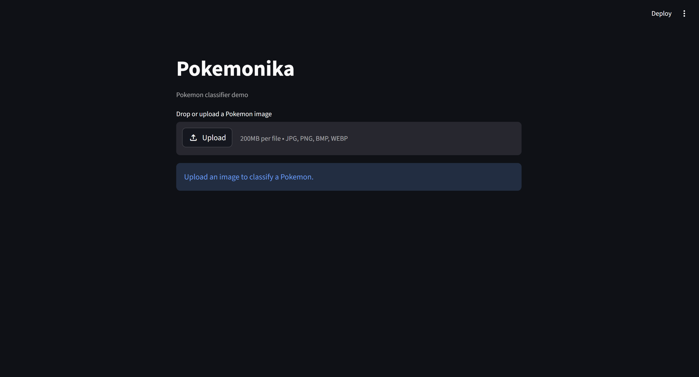
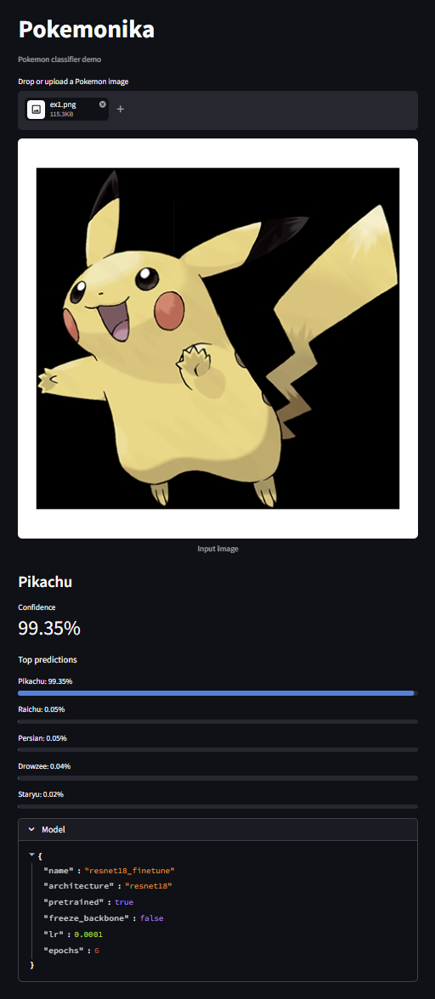
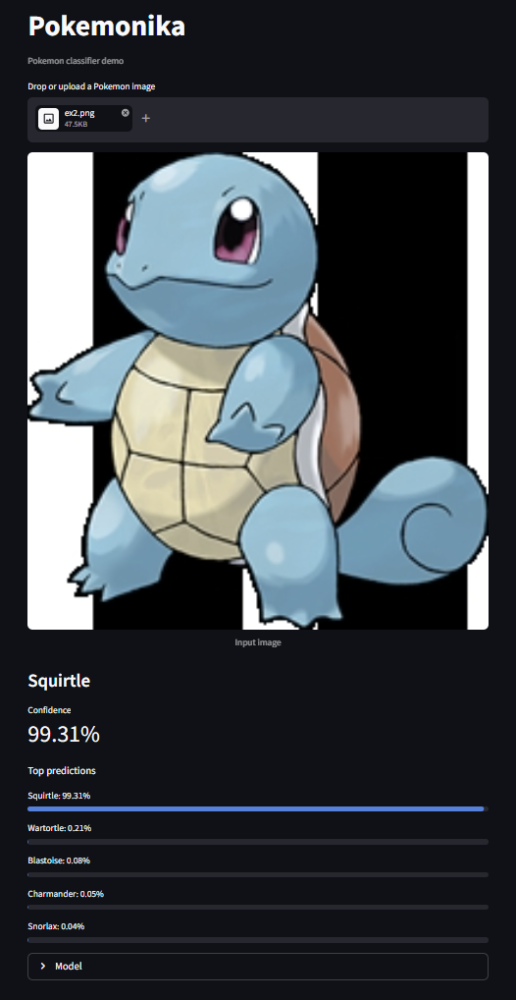

# Homework #6
# Pokemonika

Pokemonika is a Pokemon image classifier built with transfer learning. It compares four pretrained CNN experiment settings, saves the best model, and provides a Streamlit GUI for uploading a test image and viewing the top predicted Pokemon names.



## Goal

Classify the Pokemon name from a given Pokemon image.

- Dataset: 7,000 labeled Pokemon images
- Number of classes: 150
- Method: transfer learning with pretrained torchvision models
- Demo: Streamlit upload interface for image prediction

## Dataset

This project uses the Pokemon image dataset with 7,000 labeled images across 150 Pokemon classes. The dataset folder `PokemonData/` and archive `dataset.zip` are kept out of git because they are large local data files.

## Experiments

The classifier was trained with four experiment settings. Each experiment used pretrained weights and was evaluated with validation accuracy, test accuracy, precision, and recall.

| Experiment | Backbone | Fine-tuning | Best Val Acc | Test Acc | Test Macro Precision | Test Macro Recall | Test Weighted Precision | Test Weighted Recall | Time |
| --- | --- | --- | ---: | ---: | ---: | ---: | ---: | ---: | ---: |
| resnet18_finetune | ResNet-18 | all layers | 95.01% | 94.82% | 95.31% | 94.52% | 95.61% | 94.82% | 1470.99s |
| efficientnet_b0_frozen | EfficientNet-B0 | classifier head only | 76.64% | 78.79% | 80.98% | 77.93% | 81.14% | 78.79% | 632.73s |
| resnet18_frozen | ResNet-18 | classifier head only | 78.49% | 78.69% | 81.32% | 78.12% | 81.57% | 78.69% | 661.07s |
| mobilenet_v3_frozen | MobileNetV3-Small | classifier head only | 78.59% | 77.13% | 82.67% | 76.55% | 82.84% | 77.13% | 300.54s |

The best result was `resnet18_finetune`, which reached **94.82% test accuracy** and **94.82% weighted recall**. This model was copied to `artifacts/best_model.pth` for the GUI.

## Learning Curves

Refer to info.ipynb

## GUI Demo

The Streamlit GUI allows a user to drag and drop or upload a Pokemon image. It displays the input image, the most confident prediction, the confidence score, and the top prediction list.






## How to Run

After `artifacts/best_model.pth` is created, run:

```powershell
streamlit run c:/cv_class/Pokemonika/gui.py
```

The GUI model path is resolved relative to the `Pokemonika` folder, so the command can be launched from another working directory.

## Project Files

- `info.ipynb`: training, evaluation, plots, and model export workflow
- `gui.py`: Streamlit demo app
- `artifacts/metrics.csv`: experiment summary
- `artifacts/*/classification_report.txt`: detailed per-class metrics
- `artifacts/*/learning_curve.png`: training and validation curves
- `artifacts/best_model.pth`: best saved model used by the GUI
